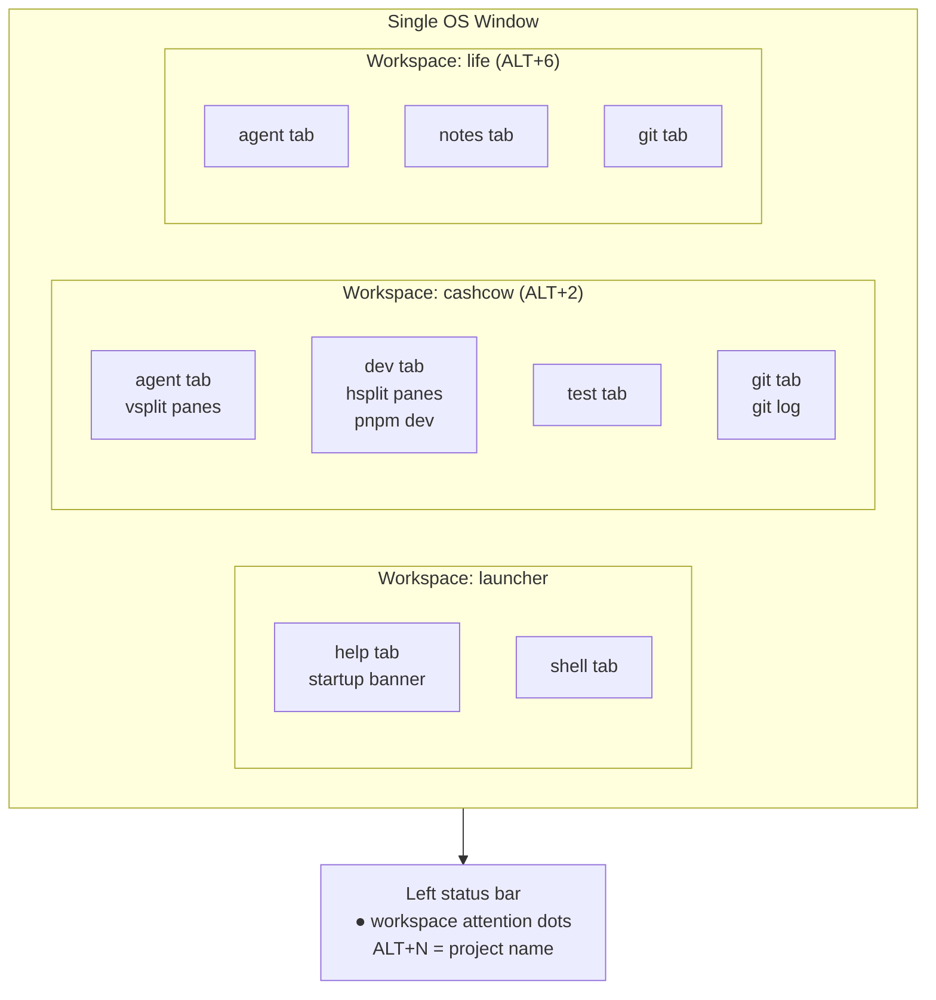

# Terminal Config — Specification & Roadmap

## Vision

A single, always-open terminal instance that:
- Starts with **one OS window** and expands to any project on demand
- Is fully navigable from the **left hand only** (no mouse required)
- Shows **persistent workspace status** in the status bar
- Has a **legible key-legend** always accessible
- Remembers session state across restarts
- Looks premium: **Crimson Noir** dark theme with proper contrast

---

## Architecture

```
dotfiles/wezterm/
├── wezterm.lua          # Main config: events, keybindings, status bar, theme
├── projects.lua         # Workspace definitions  ← edit to add projects
├── help.sh              # Startup banner (prints legend, then hands off to shell)
├── new-workspace.sh     # Interactive wizard: prompts id/label/cwd → appends to projects.lua
└── install.ps1          # Windows setup: junction ~/.config/wezterm → ~/dotfiles/wezterm

~/.config/wezterm/       # Junction → ~/dotfiles/wezterm (no elevation needed)
session_state.lua        # Auto-generated on graceful close + every 30s (do not hand-edit)
```



---

## User Flows

### Cold start
```
WezTerm opens  →  launcher workspace  →  help tab shows banner + [Enter]
→  press Enter  →  login shell ready
→  press ALT+1–7 or ALT+P  →  workspace opens in same window
```

### Open a known project
```
ALT+1–7              direct jump by slot number
ALT+P                fuzzy picker (type part of name, Enter to confirm)
ALT+← / ALT+→        cycle through all open workspaces
ALT+0                return to launcher/help
```

### Open any repo (not in projects.lua)
```
ALT+Z → O           PromptInputLine appears
type path           e.g. D:/repo/side-project
Enter               workspace created from directory basename, hsplit shell
```

### Add a permanent new project
```
ALT+Z → N           opens new-workspace.sh wizard tab
enter id / label / cwd
wizard appends entry to projects.lua
WezTerm hot-reloads  →  ALT+8 (or next slot) available immediately
```

### Navigate within a workspace
```
ALT+[ / ALT+]        prev / next tab
CTRL+ALT+1–4         jump to tab by number
LEADER |             split pane right
LEADER -             split pane down
LEADER h/j/k/l       move between panes (vim-style)
LEADER z             zoom / unzoom active pane
```

### Get help
```
ALT+Z → H            InputSelector overlay — full legend, fuzzy searchable
help tab             startup banner (re-open via ALT+0, tab 1)
```

---

## Key Binding Map

| Key | Action | Notes |
|-----|--------|-------|
| `ALT+0` | Launcher workspace | help + shell tabs |
| `ALT+1–7` | Open project workspace | slot matches projects.lua order |
| `ALT+←` / `ALT+→` | Cycle workspaces | wraps around |
| `ALT+P` | Fuzzy project picker | no LEADER required |
| `ALT+Z → O` | Open repo by path | creates ad-hoc workspace |
| `ALT+Z → N` | New workspace wizard | appends to projects.lua |
| `ALT+Z → H` | Full key legend | InputSelector overlay |
| `ALT+Z → T` | Task-complete toast | shows workspace name |
| `ALT+[` / `ALT+]` | Prev / next tab | no Windows conflict |
| `CTRL+ALT+1–4` | Jump to tab | direct by number |
| `CTRL+SHIFT+T` | New tab | same directory |
| `CTRL+SHIFT+W` | Close tab | with confirm |
| `LEADER \|` | Split pane right | vsplit |
| `LEADER -` | Split pane down | hsplit |
| `LEADER h/j/k/l` | Move between panes | vim-style |
| `LEADER z` | Zoom / unzoom pane | |
| `LEADER r` | Registry regen | stock research macro |
| `LEADER b` | Backtest sweep | stock research macro |
| `LEADER d` | pnpm dev | web project macro |

LEADER = `ALT+Z` (1.5 s window)

---

## Default Pane Layouts

| Tab title | Layout | Reason |
|-----------|--------|--------|
| `agent` | vsplit (side-by-side) | monitor AI output alongside edits |
| `dev` | hsplit (top + bottom) | server output below, shell above |
| `cmd` | hsplit | same rationale as dev |
| `test` | hsplit | test output below |
| `sys` | hsplit | logs/metrics below |
| `git` / `notes` | none (single pane) | full width for readability |

Override per-tab in `projects.lua` with `layout = "vsplit"|"hsplit"|"none"`.

---

## Feature Status

### Done
- [x] Single OS window — workspaces share one window, no per-project popups
- [x] Lazy workspace spawning — only created when first opened
- [x] ALT+1–7 direct project access
- [x] ALT+P fuzzy project picker (single chord)
- [x] ALT+Z O open-by-path (ad-hoc workspace from any directory)
- [x] ALT+Left/Right workspace cycling
- [x] ALT+[/] tab cycling (no Windows-system conflict)
- [x] Default split layouts per tab name (projects.lua layout field)
- [x] Left status bar: open workspaces + attention dots (unseen output)
- [x] Session state: 30s flush + graceful-close save, restored on next open
- [x] New workspace wizard (new-workspace.sh → projects.lua hot-reload)
- [x] Crimson Noir theme (16 ANSI slots, tab bar, cursor, selection)
- [x] Startup help banner with [Enter] pause to prevent .bashrc clear wipe
- [x] LEADER key legend overlay (ALT+Z H — InputSelector, fuzzy searchable)
- [x] Junction-based install (no symlink elevation needed on Windows)
- [x] Git-tracked dotfiles at github.com/sibulus13/terminal-config

### In Progress
- [ ] **Crimson Noir refinement** — extract to `.toml`, WCAG contrast audit, gallery publish

### Planned
- [ ] **Persistent legend panel** — always-visible keybinding bar (requires Zellij or tmux)
- [ ] **Zellij or tmux integration** — see section below
- [ ] **Per-project LEADER macros** — context-aware macros that change per workspace
- [ ] **Cross-device sync** — verify install.ps1 works on a second machine

---

## Persistent Legend Panel — Options

WezTerm has no native widget/panel system. The status bar is the only persistent display area.

| Option | Effort | Quality | Windows support |
|--------|--------|---------|-----------------|
| Expand status bar (more hints) | Low | Low — cramped | Native |
| **tmux via MSYS2** | Medium | Good — persistent bottom bar | Yes (Git Bash / MSYS2) |
| **Zellij** | Medium | Best — plugin system, WASM widgets | WSL2 only (see below) |
| Wezterm + floating overlay | High | Partial — InputSelector only | Native |

### Zellij on Windows — Current Reality

Zellij is written in Rust and has a Windows build, but as of mid-2025:
- **Native Windows**: experimental binary exists; PTY support has known issues on raw Win32
- **WSL2**: full support, recommended path for Windows users
- **Your machine**: no WSL distro installed (confirmed during initial debug) — Zellij would require setting up WSL2 first

**If you want Zellij**: install WSL2 (`wsl --install`), then install Zellij in the WSL2 distro. Run WezTerm pointing at WSL2 bash as `default_prog`, with Zellij as the WSL2 shell startup program. WezTerm handles the GPU rendering and OS window; Zellij handles multiplexing + the persistent keybinding bar.

### tmux via MSYS2 (simpler path, no WSL2)

MSYS2 ships tmux natively. Steps:
1. Install MSYS2 (`winget install MSYS2.MSYS2`)
2. `pacman -S tmux` inside MSYS2
3. Point WezTerm's `default_prog` at MSYS2 bash with tmux autostart
4. Configure `~/.tmux.conf` status bar to show key legend

This keeps everything on native Windows with no WSL2 dependency.
